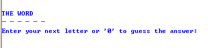
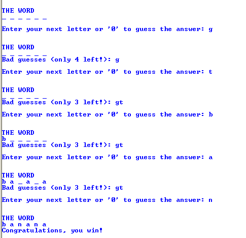
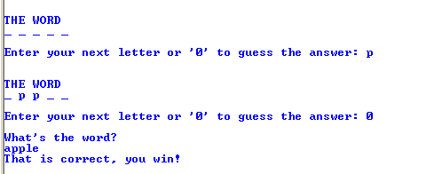
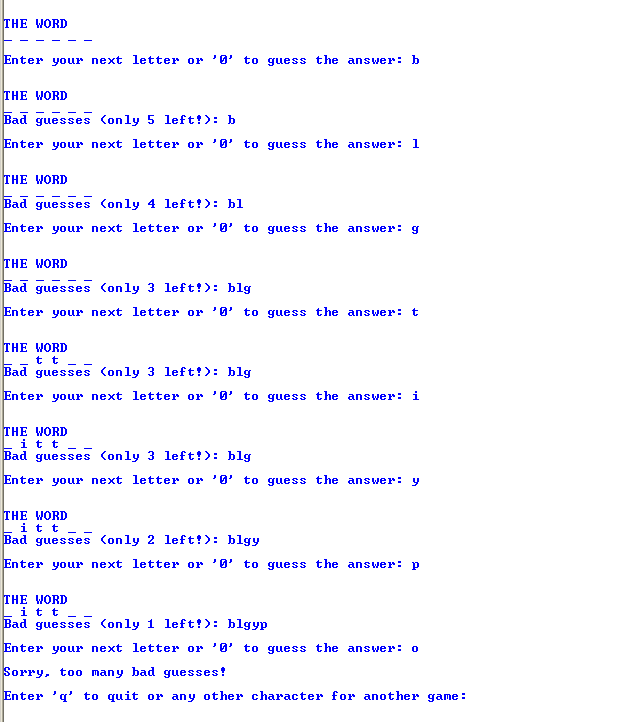
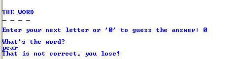
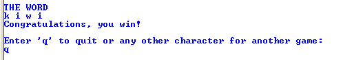

Homework: Ruby Hangman
======================

Purpose
-------

-   More experience with Ruby, including objects
-   Learn new features on your own (e.g. file IO, default parameters)

Preparation
-----------

-   You may want to [review how the game is
    played](http://en.wikipedia.org/wiki/Hangman_(game)).
-   Download [my sample word file](supplements/testWords.txt).

To work with command line arguments, read:

-   <http://ruby.about.com/od/rubyfeatures/a/argv.htm>
-   <http://stackoverflow.com/questions/8674254/trouble-passing-command-line-arguments-to-ruby-script-and-reading-from-command-l>

*Note*: Some students have identified an issue running ruby programs that use
`gets` within the Git Bash shell. You may want to use another command line (e.g.
Windows PowerShell).

Lesson
------

For this lesson you will create the game of hangman. For simplicity, we will not
display the "hangman" graphic. The user interaction for this program is
described below, with figures. Additional requirements (to exercise specific
features of Ruby) are described under Specific Requirements.

When the program starts, display a number of underscores equal to the number of
letters in the word, and a prompt to enter a letter or some character to guess
(I used '0').

Start of hangman game

One way to win the game is to guess all the letters to fill the word.

A winning game with all letters filled

Another way to win the game is to "guess" the complete word.

A winning game with complete word guessed

The game is lost if there are too many bad letter guesses. In the hangman game,
the face, body, arms and legs would be drawn. For our game we will allow 6 bad
guesses.

A losing game with too many bad guesses

Another way to lose is to enter a guess that is incorrect.

A losing game with a bad guess

Allow the user to play again or quit.

After a win or loss, prompt to play again

Your display does not need to match mine exactly.

Rubric
------

This lesson is worth **40 points**. Please read these requirements
carefully.

*6 points* Create a separate class named `Words` in a file named `words.rb` to
store word choices:

   Points  Metric
  -------- -------------------------------------------------------------------------
     2     Load words from a file into an array
     2     Allow words to be on separate lines or on one line separated by a space
     2     Include a method to randomly pick a word from the list.

*28 points* Correctly operating game with:

  -----------------------------------------------------------------------------
                  Points                 Metric
  -------------------------------------- --------------------------------------
                    4                    Display of underscores, prompts,
                                         guesses

                    4                    Game correctly determines if letters
                                         are in word, updates word and guesses
                                         display accordingly

                    1                    Convert guesses to lowercase, to avoid
                                         losing due to capitalization

                    2                    Game is won if word is filled

                    2                    Game is won if person guesses word

                    2                    Game is lost if person guesses
                                         incorrectly

                    2                    Game is lost if too many bad guesses

                    5                    User can choose to continue playing or
                                         quit. Word is chosen randomly.

                    2                    Use a default parameter for the
                                         filename. For example,
                                         `hangman = Hangman.new`. uses the
                                         default parameter (in my case,
                                         `testWords.txt`), but I can do
                                         `hangman = Hangman.new "words.txt"` to
                                         specify another file.

                    4                    Code includes comments and is modular
                                         (small methods, each has one "job" to
                                         do)

                    2                    Follows *simplicity of grading*
                                         requirements, including the use of a
                                         command-line argument.
  -----------------------------------------------------------------------------

*4 points* Create a unit test for `Words`:

   Points  Metric
  -------- ------------------------------
     2     Test loading the file
     2     Test selecting a random word

Submit
------

For simplicity of grading, please:

-   Name your program `hangman.rb`
-   Name your test program `words_test.rb`
-   Name your words program `words.rb`
-   Be sure to use my words file (`testWords.txt`) as the default
-   Use relative pathnames for the words files. **Do not** include a complete
    path that will only work on your system.
-   Be sure to zip the `.txt` files along with your `.rb` file(s)
-   The grader should be able to play hangman by typing `ruby hangman.rb` or
    `ruby hangman.rb "otherWords.txt"` at the command line.
-   The grader should be able to run your tests by typing `ruby words_test.rb`
    at the command line.

Zip all your `.rb` and `.txt` files and submit on Canvas.
