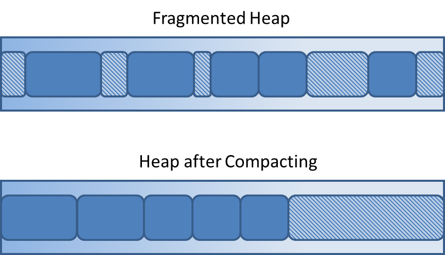

---
date: 31 August 2017
title: Object Lifetime and Pointers
subtitle: CSCI 400
author: Colorado School of Mines
theme: Amsterdam
...

Color Key
---------

-   [\link{Clickable URL link}](https://www.youtube.com/watch?v=8FEFClgA37E)
-   \q{Write down an answer to this for class participation}
-   \comment{Just a comment -- don't confuse with yellow}

Object Lifetime
===============

Why do we care?
---------------

Could affect:

-   \hl{Performance}
-   \hl{Reliability}
    -   e.g. Ease of debugging
-   \hl{Language choice}

Object Lifetime
---------------

-   \kwd{Lifetime of a variable}
    -   Time during which the variable is bound to a particular memory cell
-   Ruby built-in objects created when value assigned
    -   e.g. `x = 5`{.ruby}
    -   Other classes create with `new`{.ruby}
-   Factory methods also create objects
-   Ruby uses \hli{garbage collection}
    -   Destroys objects that are no longer reachable

Object Lifetimes
----------------

1.  \hl{Static}
2.  \hl{Stack (Dynamic)}
3.  \hl{Explicit heap (Dynamic)}
4.  \hl{Implicit heap (Dynamic)}

Variables by Lifetime: (1) Static
---------------------------------

-   Bound to memory cells \hli{before execution begins}
    -   Not allocated on stack or heap
-   Remains bound to same memory \hli{throughout execution}
-   \hl{Usage}: Similar to global variables, but always local to declaring file
-   Examples
    -   All FORTRAN 77 variables, C `static`{.c} variables
    -   But \hli{not} C++ class variables

Variables by Lifetime: (1) Static
---------------------------------

\hl{Example}

```c
// `count` allocated here (prior to runtime)
void fn() {
    static int count = 0;
    count ++;
    std::cout << count;
}

fn();
fn();
```

Variables by Lifetime: (1) Static
---------------------------------

-   \hl{Advantages}
    -   Efficiency -- \hli{direct addressing}
    -   A subprogram can use across multiple executions
-   \hl{Disadvantages}
    -   Bad when value needs to be \hli{reinitialized} (e.g. recursion)
    -   Storage can't be shared betweeen subprograms

Variables by Lifetime: (2) Stack
--------------------------------

-   Created when \hli{execution reaches code}
-   Allocated to runtime stack
-   Variables may be allocated at beginning of method, even if declared later

Variables by Lifetime: (2) Stack
--------------------------------

\hl{Example}

```c
// param, temp, temp2 not allocated here
void fn(int param) {
    int temp;
    int temp2;
    // param, temp, temp2 now allocated 
}
```

Variables by Lifetime: (2) Stack
--------------------------------

-   \hl{Advantages}
    -   Good when value needs to be \hli{reinitialized} (e.g. recursion)
    -   Conserves storage (deallocated once out of scope)
-   \hl{Disadvantages}
    -   Overhead of allocation/deallocation
        -   Not too bad, since all memory allocated/deallocated together
    -   Subprograms cannot be history-sensitive
    -   Inefficient references -- \hli{indirect addressing}

Variables by Lifetime: (3) Explicit Heap
---------------------------------------

-   (De)Allocated at runtime by explicit directives
    -   e.g. `new`{.cpp}/`delete`{.cpp}, `malloc`{.cpp}/`free`{.cpp}
-   Accessed only through \hli{pointers} or \hli{references}
-   Examples
    -  Dynamic objets in C++
    -  All obects in Java

Variables by Lifetime: (3) Explicit Heap
----------------------------------------

\hl{Examples}

```c
void fn1() {
    int* nums = new int[5];
    // ...
}

public void fn2() {
    Point point = new Point();
    // ...
}
```

Variables by Lifetime: (3) Explicit Heap
----------------------------------------

-   \hl{Advantage}
    -   Don't need to predict exact memory requirements beforehand
    -   Can modify if needed, e.g. resizing an array
-   \hl{Disadvantages}
    -   Inefficient -- \hli{Heap fragmentation} (see next slide)
    -   Unreliable -- \hli{Dangling pointers}, \hli{memory leaks}

Heap Fragmentation
------------------



Variables by Lifetime: (4) Implicit Heap
----------------------------------------

-   Basically same as \hl{Explicit Heap}, except...
    -   No `new`{.c}/`delete`{.c} -- these are \hli{implied}
-   Identifiers (often) don't have explicit types
    -   `x = 3; x = "bob";`{.ruby}
-   Examples
    -   All variables in APL
    -   All strings and arrays in Perl, Javascript

Variables by Lifetime: (4) Implicit Heap
----------------------------------------

\hl{Examples}

```ruby
# memory allocation (onto heap) + type binding done at
# declaration
list = [2, 4.33, 6, 8]
```

Variables by Lifetime: (4) Implicit Heap
----------------------------------------

-   \hl{Advantage}
    -   Writeability -- Compiler/interpreter handles details
    -   Flexibility -- Types are implicit
-   \hl{Disadvantages}
    -   Inefficient -- \hli{Heap fragmentation}
    -   Unreliable -- Difficult to detect errors (e.g. type errors)

Pointers and References
=======================

Pointer Operations (Review)
---------------------------

Two fundamental operations:

1.  \hl{Assignment} -- used to set pointer variable's value to some useful
    address
    -   `int *ptr = new int;`{.c}
2.  \hl{Dereferencing} -- yields the value stored at pointer's address
    -   `*ptr = 206`{.c}
    -   `int j = *ptr`{.c}

Pointers
--------

-   Stores a \hli{memory address}
    -   Often has special value, e.g. `NULL`{.c} or `nil`{.go}, but not always
        (Rust)
-   Provide means of \hli{dynamic memory management}
    -   Can use to access area where storage is dynamically created (the
        \hli{heap})
-   Not necessary for all pointers to reference the heap
    -   \comment{C++ example?}

Pointer to Stack Address
------------------------

In C/C++, it is not necessary for all pointers to reference the heap:

```c
int x = 5;
int *ptr = &x;
```

Pointer Operations
------------------

-   Dereferencing can be \hli{implicit} or \hli{explicit}
-   C++ uses an \hli{explicit} operation, via `*`{.c}
    -   `j = *ptr; // set j to value stored at ptr`{.c}
    -   `*ptr = 5; // set value stored at ptr to 5`{.c}
-   C++ also does \hli{implicit} dereferencing of \hli{reference variables}
    ```c
    void fn(int& x) {
        x = 5; // value also changed for caller
    }
    ```

Pointer Arithmetic in C/C++
---------------------------

```c
float arr[20]
float *ptr;
ptr = &arr;
```

-   `ptr`{.c} is an \hli{alias} for `arr`{.c}
    -   `*(ptr+i)` is equivalent to `stuff[i]`{.c} and `ptr[i]`{.c}

Pointer Arithmetic in C/C++
---------------------------

\graphicwc{img/pointer_array_memory.png}{2.0in}{Pointer as alias to Array}

Pointers in C/C++: `void*`{.c}
------------------------------

-   Domain type need not be fixed: `void*`{.c}
    -   `void*`{.c} can point to \hli{any type}
        -   Use typecasts when needed, e.g. `(int*)void_ptr ...`{.cpp}
    -   `void*`{.c} \hli{cannot} be dereferenced
    -   `void*`{.c} often used in C to pass as arguments (TODO)
-   In C++, generally better to use templates so compiler can do appropriate
    type-checking

Question
--------

\comment{Do you remember the difference between a {\it dangling pointer} and a
{\it memory leak}?}

Problems with Pointers (review)
-------------------------------

-   \hl{Dangling pointers}
    -   Pointer pointing to \hli{heap-dynamic} variable that has been
        deallocated
    -   That memory \hli{may} have been reallocated
    -   Value no longer meaningful
    -   Writing to it could corrupt memory
-   Example
    ``` {.cpp}
    Point p = new Point(3, 4);
    delete p; // dangling -- p still has address!
    std::cout << p.getX(); // bad!
    ```

Problems with Pointers (review)
-------------------------------

-   \hl{Memory leak}
    -   Memory has \hli{not} been deleted/returned to heap manager
    -   \hli{Inaccesible:} No variables contain the address
-   When is this a problem?
    -   One-off programs, small school assignments? No...
    -   Long running programs, e.g. web servers? Yep...
    ```cpp
    int[] p = new int[5000];
    p = new int[10000]; // p contains new address
    ```

Reference Types
---------------

C++ includes a special kind of pointer typed, called a \hli{reference type}

-   Used primarily for formal parameters
-   Constant pointer\Noteref that is always \hli{implicitly dereferenced}
    -   Notice no `*`{.cpp} in the code below

    ``` {.cpp}
    void fn(int &y) {
        y = y + 1; 
    }
    ```

\Note{What does {\it constant pointer} mean?}

Reference Types: Point of confusion
-----------------------------------

-   \hli{Constant pointer}
    -   \hli{Can't} change \hli{where} it points
    -   \hli{Can} change \hli{contents}
-   Java
    -   Uses references to objects, but \hli{can} change address it references
    -   Implicitly dereferenced
    -   No pointer arithmetic -- Java \hli{does not} have pointers
-   C# has references like Java and pointers like C++

Pointers vs. References
-----------------------

\hl{Broadly speaking:}

-   \hl{Pointers}
    -   \hli{Do} support pointer arithmetic
    -   Must be \hli{explicitly} dereferenced
-   \hl{References}
    -   \hli{Do not} support pointer arithmetic
    -   Are \hli{implicitly} dereferenced 

\comment{Mutability of address/contents depends on context}

What about Ruby?
----------------

-   Does Ruby have references or pointers?
    -   \hl{A}: References
        ([\link{read}](https://stackoverflow.com/questions/7208768/is-it-possible-to-use-pointers-in-ruby))
-   Ruby also has \hli{garbage collection (GC)}\Noteref

\Note{What problem does GC solve? (Dangling pointers, memory leaks?)}
